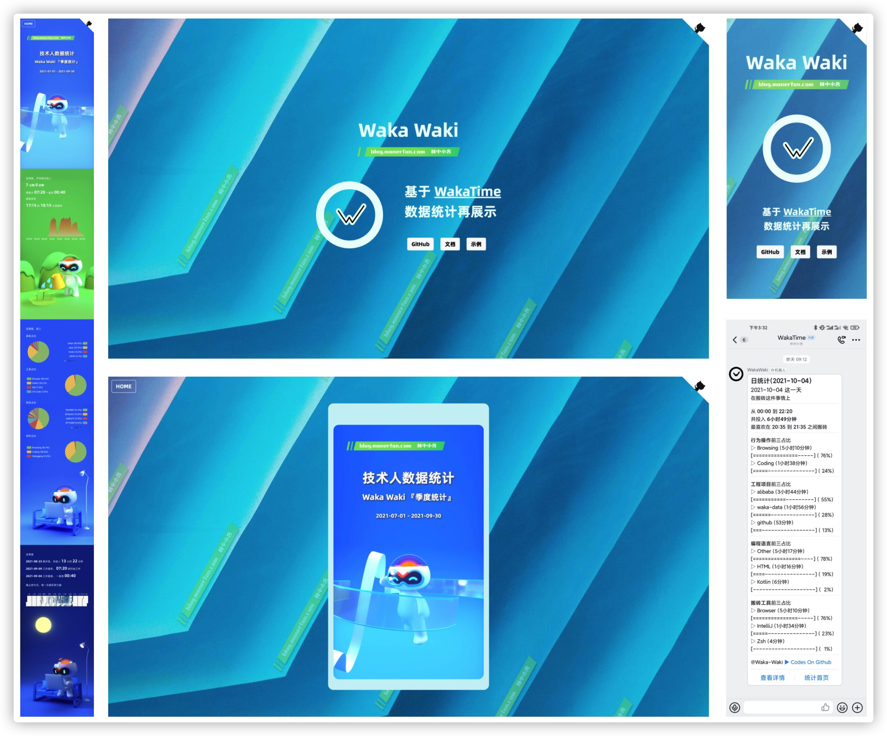

# Waka-data

[](https://github.com/manerfan/waka-data/actions/workflows/main.yml)

[](http://openjdk.java.net/projects/jdk/11)
[](https://kotlinlang.org)
[](https://vertx.io)

[](https://github.com/manerfan)
[](https://github.com/manerfan/waka-data)

[](https://github.com/manerfan/waka-data/blob/main/LICENSE)

## 文档

https://manerfan.github.io/waka-data/

## 背景

几年前发现 [WakaTime](https://wakatime.com/) ，可以非常精准的记录日常搬砖情况

> [WakaTime](https://wakatime.com/)  
> Dashboards for developers  
> Open source plugins for metrics about your programming
>
> 支持的 IDE [https://wakatime.com/plugins](https://wakatime.com/plugins)  
> 需要的 API KEY [https://wakatime.com/settings/account](https://wakatime.com/settings/account)  
> 开发文档 [https://wakatime.com/developers](https://wakatime.com/developers)  

但对个人（非付费）用户来说，数据最长仅能保留一周，直到前段时间突然有了自己做的想法，于是，Waka Waki 诞生了



## 能做什么

- 能够拉取 WakaTime 的数据
- 能够在 天、周、月、季度、年 不同时间维度上做简单的数据统计
- 能够每天定时运行并生成文字版、图文版（HTML）报告
- 能够通过多种途径进行推送，并适配不同的设备

## 如何使用

### fork 项目

[https://github.com/manerfan/waka-data/fork](https://github.com/manerfan/waka-data/fork)

### 配置Secrets

配置 Secrets 是为了提供运行过程中需要的一些敏感参数

> 了解 GitHub Secrets [https://docs.github.com/en/actions/security-guides/encrypted-secrets](https://docs.github.com/en/actions/security-guides/encrypted-secrets)

|类型|参数|说明|
| ------------ | ------------------ | ------------------------------------------------------------ |
| WakaTime     | WAKA_API_KEY         | WakaTime 账号 ApiKey，用于拉取 WakaTime 数据使用<br />[https://wakatime.com/settings/account](https://wakatime.com/settings/account) |
| Aliyun OSS   | OSS_ENDPOINT        | 阿里云 OSS Endpoint<br />bucket概览中查看                    |
| Aliyun OSS   | OSS_BUCKET_NAME      | 阿里云 Oss Bucket                                            |
| Aliyun OSS   | OSS_ACCESS_KEY_ID     | 阿里云账号 AccessKeyId                                       |
| Aliyun OSS   | OSS_ACCESS_KEY_SECRET | 阿里云账号 AccessKeySecret                                   |
| 钉钉         | DING_ROBOT_WEBHOOK   | 钉钉群机器人 WebHook                                         |
| GitHub Pages | REPORT_HOME_URL      | GitHub Pages 发布地址，用于拼接报告页面地址                  |

## 如何调试

### clone 项目

```shell
git clone https://github.com/manerfan/waka-data.git
```

### 配置 Secrets

修改 `gradle.properties`<br />参考 [如何使用-配置 Secrets]

### 运行程序

```shell
./gradlew run
```


